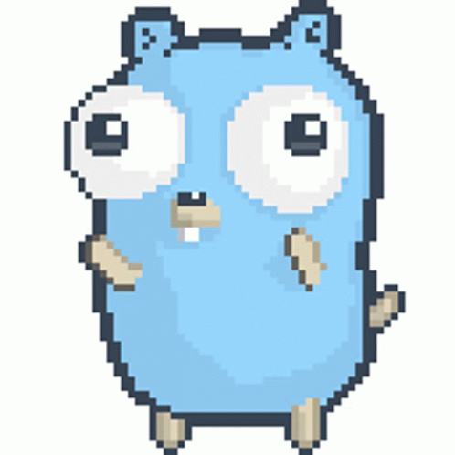

<div align="center">



#  GO 

### The Ultimate Technical Guide to the Go Programming Language

**Everything you need to know about Go from Syntax to Production-Grade Systems.**

<p align="center">
  
  
  
</p>

</div>

---

##  01. The Go Philosophy

Go (often referred to as Golang) was created at Google in 2007 by Robert Griesemer, Rob Pike, and Ken Thompson. It was designed to solve common software engineering problems: slow builds, complex codebases, and the challenges of multi-core networking.

### Core Design Principles:

1.  **Simplicity**: Go is a small language. It purposefully lacks features like classes, inheritance, and assertions to keep the language regular and easy to learn.
2.  **Orthogonality**: Features work together in predictable ways.
3.  **Fast Compilation**: The compiler is designed to be lightning-fast, providing a feedback loop similar to interpreted languages.
4.  **Conforming to Hardware**: Go's memory layout and concurrency primitives are designed to exploit modern multi-core hardware efficiently.

---

##  02. Type System & Syntax

Go is statically typed and provides strong type safety without the verbosity of Java or C++.

### Basic Declarations

```go
var x int = 10         // Explicit type
var y = 20            // Type inference
z := 30               // Short declaration (inside functions)
const Pi = 3.14       // Constants
```

### Primitive Types

| Category     | Types                                                |
| :----------- | :--------------------------------------------------- |
| **Integers** | `int8`, `int16`, `int32`, `int64`, `uint`, `uintptr` |
| **Floats**   | `float32`, `float64`                                 |
| **Strings**  | `string` (immutable UTF-8)                           |
| **Booleans** | `bool`                                               |
| **Complex**  | `complex64`, `complex128`                            |

---

##  03. Collections: Slices & Maps

Go provides powerful built-in collections that are fundamental to almost every program.

### Slices (Dynamic Arrays)

Slices are a window into an underlying array. They provide flexibility and efficient memory usage.

```go
nums := []int{1, 2, 3}       // A slice
nums = append(nums, 4, 5)    // Dynamic resizing
subset := nums[1:3]          // Slicing (inclusive:exclusive)
```

### Maps (Hash Tables)

```go
m := make(map[string]int)
m["key"] = 100
val, exists := m["key"]     // Safe retrieval
delete(m, "key")            // Removal
```

---

##  04. Concurrency: The Go Way

Go's primary strength is its concurrency model, based on **Communicating Sequential Processes (CSP)**.

### Goroutines

A goroutine is a lightweight thread managed by the Go runtime. They start with only 2KB of stack space.

```go
go doWork() // Starts a new concurrent execution
```

### Channels

Channels are the pipes that connect concurrent goroutines. You can send values from one goroutine to another.

```go
ch := make(chan int)
go func() {
    ch <- 42 // Send
}()
val := <-ch  // Receive
```

### The `select` Statement

Standard way to wait on multiple channel operations.

```go
select {
case msg1 := <-c1:
    fmt.Println("Received", msg1)
case c2 <- "hello":
    fmt.Println("Sent hello")
default:
    fmt.Println("Nothing ready")
}
```

---

##  05. The Power of Interfaces

Interfaces in Go are **implicit**. A type implements an interface by simply implementing its methods.

```go
type Shape interface {
    Area() float64
}

type Circle struct {
    Radius float64
}

// Circle implicitly implements Shape
func (c Circle) Area() float64 {
    return math.Pi * c.Radius * c.Radius
}
```

This "Duck Typing" allows for highly decoupled and testable code without complex inheritance hierarchies.

---

##  06. Error Handling

Go does not have exceptions. Instead, errors are treated as values. This forces developers to consider potential failures at every step.

```go
f, err := os.Open("file.txt")
if err != nil {
    // Handle the error immediately
    log.Fatalf("failed to open: %v", err)
}
defer f.Close() // Cleanup happens when function returns
```

---

##  07. The Go Toolchain

The standard Go installation provides all the tools you need for a professional workflow.

| Command         | Description                                              |
| :-------------- | :------------------------------------------------------- |
| `go build`      | Compiles packages and dependencies.                      |
| `go run`        | Compiles and runs a main package.                        |
| `go fmt`        | Formats source code according to the community standard. |
| `go test`       | Runs tests and benchmarks.                               |
| `go mod`        | Manages project dependencies (Go Modules).               |
| `go vet`        | Examines source code and reports suspicious constructs.  |
| `go tool pprof` | Advanced profiling for performance tuning.               |

---

##  08. Standard Library Highlights

Go’s standard library is often called "the kitchen sink" because it's massive and production-ready.

- `net/http`: Build production-grade web servers and clients.
- `encoding/json`: High-performance JSON parsing and generation.
- `sync`: Low-level synchronization primitives (Mutex, WaitGroup).
- `io` & `os`: Robust interfaces for I/O and OS interaction.
- `crypto`: Industrial-strength cryptographic libraries.

---

##  09. Generics (Go 1.18+)

Generics allow you to write functions and data structures that work with any type while maintaining type safety.

```go
func Set[T comparable](items []T) []T {
    seen := make(map[T]bool)
    var result []T
    for _, item := range items {
        if !seen[item] {
            seen[item] = true
            result = append(result, item)
        }
    }
    return result
}
```

---

##  10. Memory Management

Go features a highly optimized **Garbage Collector (GC)** designed for low latency.

- **Stack vs Heap**: The compiler uses "escape analysis" to decide whether to put a variable on the stack (fast) or the heap (needs GC).
- **Pointers**: Go has pointers but NO pointer arithmetic, making it memory-safe while still allowing efficient data sharing.
- **Value Receivers vs Pointer Receivers**: Crucial for deciding if a method should modify the original struct or a copy.

---

##  11. Testing & Benchmarking

Testing is a first-class citizen in Go.

### Unit Tests

```go
func TestSum(t *testing.T) {
    total := Sum(2, 2)
    if total != 4 {
        t.Errorf("Sum was incorrect, got: %d, want: %d.", total, 4)
    }
}
```

### Benchmarks

```go
func BenchmarkSum(b *testing.B) {
    for i := 0; i < b.N; i++ {
        Sum(2, 2)
    }
}
```

---

##  12. Deployment Patterns

Go compiles into a **single static binary** with all dependencies included. This makes it a perfect fit for Docker and microservices.

### Minimalist Dockerfile

```dockerfile
# Build Stage
FROM golang:1.21-alpine AS builder
WORKDIR /app
COPY . .
RUN go build -o main .

# Run Stage
FROM alpine:latest
COPY --from=builder /app/main /main
CMD ["/main"]
```

_Resulting image is often < 20MB!_

---

<div align="center">

### Credits & Resources

- **Official Docs**: [go.dev](https://go.dev)
- **Best Practices**: [Effective Go](https://go.dev/doc/effective_go)
- **Playground**: [Go Playground](https://go.dev/play/)

<br>

**Built with  for the Go Community**

</div>
